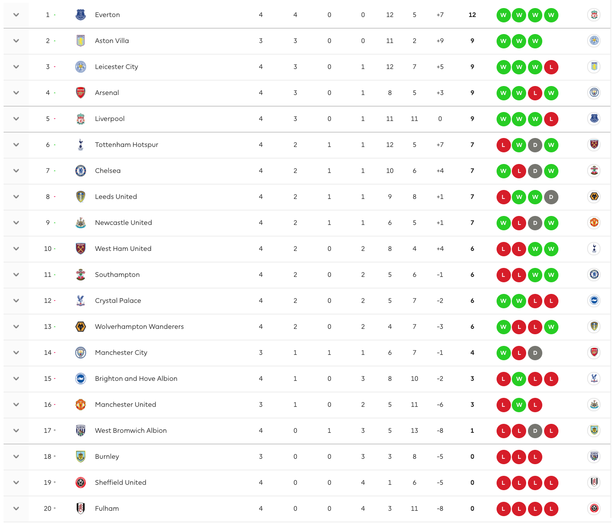
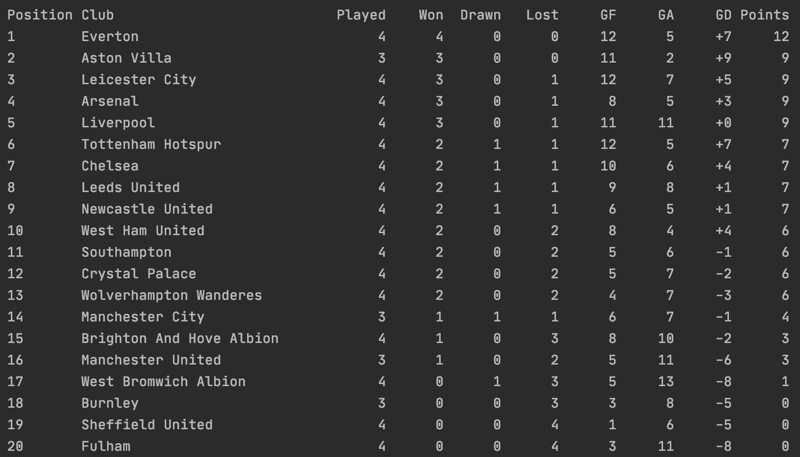

# League table generator

### Task details

Consider a league table for football. Each team plays a number of matches and the results
of each match build the table. Given the code attached as a starting point build
the LeagueTable class that can take a list of completed matches and produce a sorted 
list of LeagueTableEntry objects.

The sorting rules for entries in the league table should be
* Sort by total points (descending)
* Then by goal difference (descending)
* Then by goals scored (descending)
* Then by team name (in alphabetical order)
A win is worth three points to the winning team. A draw is worth one point to each team.

Your code will be run through a series of JUnit tests to validate the implementation so it is important 
that method signatures are not changed. You will also be assessed on code quality and clarity.

In undertaking this task, please consider the following:
* You should be submitting production quality code
* Future reuse and extension of code
* Any documentation / notes on build

---
# Solution and explanation

### What is necessary to run the project

- Java 11
- Gradle 6.3 or newer

The project has no entry point, so you can run the tests to check the implementation through: `./gradlew test`

### Explanation

All code was implemented inside the class `LeagueTable` keeping in mind don't change the original code structure.

The method `LeagueTable.getTableEntries()` was implemented using a HashMap for each team name. Below implementation:

```
public List<LeagueTableEntry> getTableEntries() {
    Map<String, LeagueTableEntry> leagueTableEntries = new HashMap<>();

    matches.forEach(match -> {
        var homeTeam = getOrCreate(leagueTableEntries, match.getHomeTeam());
        var awayTeam = getOrCreate(leagueTableEntries, match.getAwayTeam());

        homeTeam.increasePlayed();
        awayTeam.increasePlayed();
        countScores(match, homeTeam, awayTeam);
        countMatchResult(match, homeTeam, awayTeam);
    });

    return leagueTableEntries.values().stream()
            .sorted(Comparator.comparing(LeagueTableEntry::getPoints).reversed()
                    .thenComparing(LeagueTableEntry::getGoalDifference, Comparator.reverseOrder())
                    .thenComparing(LeagueTableEntry::getGoalsFor, Comparator.reverseOrder())
                    .thenComparing(LeagueTableEntry::getTeamName)).collect(Collectors.toList());
}
```
An important thing about this method and class is that all variables were named to be clean and easy for other developers to take a look and understand the code.

Step-by-step:
   * With a list of matches, to avoid duplicate values I used the team Name as a Key in a HashMap, so for each Match I pick it up and manage the data around the team using the map.
   * The second step is increase the number of match for the home team and away team.
   * Third step is count the scores for and scores against.
   * Fourth step is count the match result and increase 3 points to the winner, 1 point for each when drawn and no point for who lost the match.
   * After all, in the fifth step, the sorted rules were applied as required in the task specification: Sort by total points (descending), then by goal difference (descending), then by goals scored (descending), then by team name (in alphabetical order).

---
About the small methods: 

* `getOrCreate`: Try get the existing team metadata from the map, when it doesn't exist, create a new one and return it.
* `countScores`: increase the goals for and goals against according the match result.
* `countMatchResult`: Responsible to check who won the match and set the correct amount of points for each team.

---
### Tests

It was included in `build.gradle` the `jacoco plugin` to see the test coverage and test results.

e.g.: Run `./gradlew build jacocoTestReport` to generate the reports and access them in `./build/reports/jacoco/test/html/index.html` and `./build/reports/jacoco/tests/test/index.html`.

Bellow results when I created this solution (only five tests to test the league table generated):


And below, coverage tests (consider that all method where the test coverage is missing are `set` methods that aren't used here):


### Special test case

I created a special test case using the official matches results to test the code and verify the results in the algorithm with the official table. Bellow:
I created a const variable `LeagueTableTests.PRINT_TABLE_ON_CONSOLE` and when this variable is true, the table will be printed on the console as the bellow image.

Oficial results:


Generated by unit tests:

