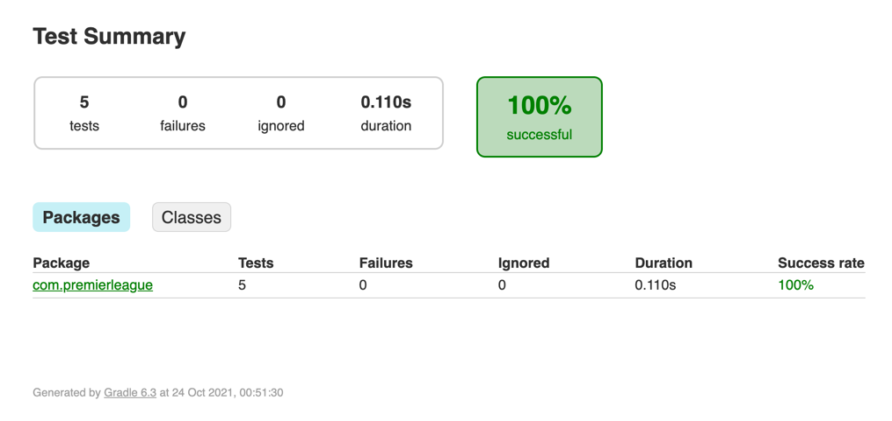
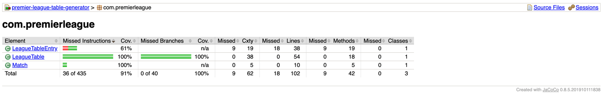
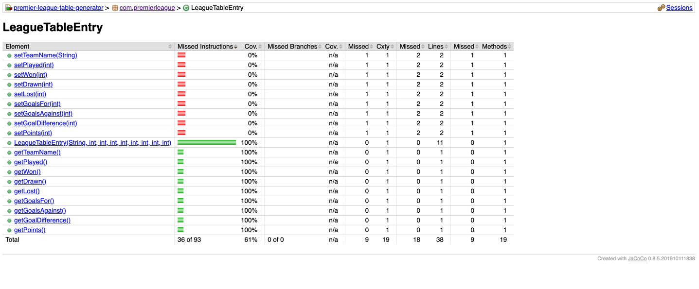

# Pulselive - interview: League table generator

### Task details

Consider a league table for football. Each team plays a number of matches and the results
of each match build the table. Given the code attached as a starting point build
the LeagueTable class that can take a list of completed matches and produce a sorted 
list of LeagueTableEntry objects.

The sorting rules for entries in the league table should be
* Sort by total points (descending)
* Then by goal difference (descending)
* Then by goals scored (descending)
* Then by team name (in alphabetical order)
A win is worth three points to the winning team. A draw is worth one point to each team.

Your code will be run through a series of JUnit tests to validate the implementation so it is important 
that method signatures are not changed. You will also be assessed on code quality and clarity.

In undertaking this task, please consider the following:
* You should be submitting production quality code
* Future reuse and extension of code
* Any documentation / notes on build

---
# Solution and explanation

### What is necessary to run the project

- Java 8 (I'm using Java 14 in my laptop)
- Gradle 6.3 (but it's possible use the file ./gradlew in this project)

Run the tests with: `./gradlew test`

### Explanation

All code was implemented inside the class `LeagueTable` keeping in mind don't change the structure that was sent.
It was created some private and small methods with separated behaviors thinking in clean, future reuse and extension of code.
Each method has a unique responsibility respecting the DRY pattern (Don't repeat yourself) and if in the future information is needed about the matches, the methods can be used.

The method `LeagueTable.getTableEntries()` was implemented calling the small methods that return only one information as said. Below implementation:

```
public List<LeagueTableEntry> getTableEntries()
{
  List<String> teamNames = getUniqueTeamNames();
  List<LeagueTableEntry> leagueTableEntries = new ArrayList<>();

  for (String teamName : teamNames)
  {
    int played = getPlayed(teamName);
    int won = getWon(teamName);
    int drawn = getDrawn(teamName);
    int lost = getLost(teamName);
    int goalsFor = getGoalsFor(teamName);
    int goalsAgainst = getGoalsAgainst(teamName);
    int goalDifference = goalsFor - goalsAgainst;
    int points = (won * 3) + drawn;

    leagueTableEntries.add(
        new LeagueTableEntry(teamName, played, won, drawn, lost, goalsFor, goalsAgainst,
            goalDifference, points));
  }

  leagueTableEntries.sort(Comparator.comparing(LeagueTableEntry::getPoints).reversed()
      .thenComparing(LeagueTableEntry::getGoalDifference, Comparator.reverseOrder())
      .thenComparing(LeagueTableEntry::getGoalsFor, Comparator.reverseOrder())
      .thenComparing(LeagueTableEntry::getTeamName));

  return leagueTableEntries;
}
```
An important thing about this method is that all variables were named to be clean and easy for other developers to take a look and understand the code.

Step-by-step:
   * With a list of matches, it's necessary to know all teams that played at home or away. So, the first step was to call a method to return all team names (unduplicated).
   * The second step was to go through the list of the team names and verify each match to get each information about that team: the amount of matches played, won, drawn, lost, goals for, goals against. And then with the goals for and goals against, to get the goal difference, I made `goalsFor` minus `goalsAgainst`. And then to get the points were multiplied the amount of won by 3 and plus with total of draws.
   * After all, in the third step, the sorted rules were applied as required in the task specification: Sort by total points (descending), then by goal difference (descending), then by goals scored (descending), then by team name (in alphabetical order).
      * The strategy to order the table was to use the `sort` method from `List`. Inside this method is used `Arrays.sort()` that has a stable, adaptive, and iterative mergesort.

---
About the small methods: 

* `getUniqueTeamNames`: This method uses a flatMap to join the team names from home and away and return the names unduplicated.
* `getPlayed`: This is a simple method to return the number of matches that a team played.
* `getWon`, `getDrawn` and `getLost`: These methods are similar and filter and return the amount of won, draw and lost.
* `getGoalsFor` and `getGoalsAgainst`: These methods are similar and get the goals for and goals against.

---
### Considerations

* I kept the small methods inside the `LeagueTable` class to keep the structure that was sent. 
   * Could be created a utility class with these methods to become these methods public and create unit tests to ensure more code coverage in the tests. I created an alternative application with this change to express what I thought, this application can be accessible in the file alternative_app.zip. But I'm delivering this alternative application for just express another form to resolve this problem that allows creating more unit tests with public methods.
   
### Tests

It was included in `build.gradle` the `jacoco plugin` to see the test coverage and tests results.

e.g.: Run `./gradlew build jacocoTestReport` to generate the reports and access them in `./build/reports/jacoco/test/html/index.html` and `./build/reports/jacoco/tests/test/index.html`.

Bellow results when I created this solution (only five tests to test the league table generated):



And below, coverage tests (consider that all method where the test coverage is missing are `set` methods that aren't used here):



